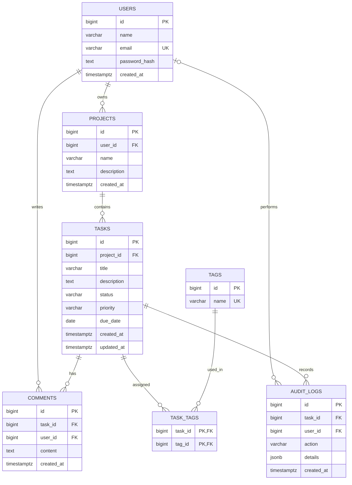

# Task Tracker Database – ER Diagram

```mermaid
erDiagram
    USERS ||--o{ PROJECTS : owns
    USERS ||--o{ COMMENTS : writes
    USERS o|--o{ AUDIT_LOGS : performs

    PROJECTS ||--o{ TASKS : contains

    TASKS ||--o{ COMMENTS : has
    TASKS ||--o{ TASK_TAGS : assigned
    TAGS ||--o{ TASK_TAGS : used_in

    TASKS ||--o{ AUDIT_LOGS : records

    USERS {
        bigint id PK
        varchar name
        varchar email UK
        text password_hash
        timestamptz created_at
    }

    PROJECTS {
        bigint id PK
        bigint user_id FK
        varchar name
        text description
        timestamptz created_at
    }

    TASKS {
        bigint id PK
        bigint project_id FK
        varchar title
        text description
        varchar status
        varchar priority
        date due_date
        timestamptz created_at
        timestamptz updated_at
    }

    COMMENTS {
        bigint id PK
        bigint task_id FK
        bigint user_id FK
        text content
        timestamptz created_at
    }

    TAGS {
        bigint id PK
        varchar name UK
    }

    TASK_TAGS {
        bigint task_id PK, FK
        bigint tag_id PK, FK
    }

    AUDIT_LOGS {
        bigint id PK
        bigint task_id FK
        bigint user_id FK
        varchar action
        jsonb details
        timestamptz created_at
    }
```
